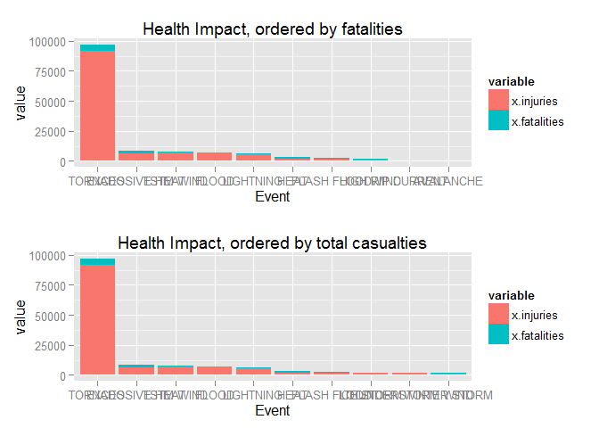
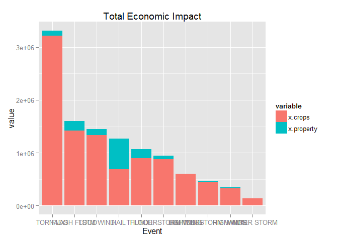
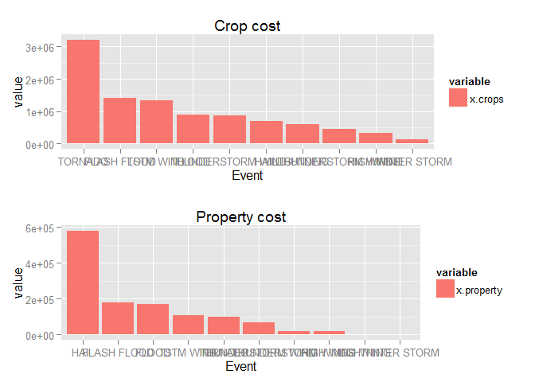

# Human & economic consequences of severe storm events in the US
Christopher Lovell  
Sunday, December 21, 2014  


We wish to answer the following two questions in this analysis:
1. Across the United States, which types of events are most harmful with respect to population health?
2. Across the United States, which types of events have the greatest economic consequences?

This should act as supporting material or a set of recommendations to policy makers on the events of highest priorities when wishing to address the human and economic cost of storms. 

We will do this using the NOAA Storm Data. This contains details on all recorded storm events between 1950 through to 2011.

# Data Processing


```r
data<-read.csv("..//input//repdata-data-StormData.csv")
```

Let's look at the summary information for our data set:


```r
summary(data)
```

```
##     STATE__                  BGN_DATE             BGN_TIME     
##  Min.   : 1.0   5/25/2011 0:00:00:  1202   12:00:00 AM: 10163  
##  1st Qu.:19.0   4/27/2011 0:00:00:  1193   06:00:00 PM:  7350  
##  Median :30.0   6/9/2011 0:00:00 :  1030   04:00:00 PM:  7261  
##  Mean   :31.2   5/30/2004 0:00:00:  1016   05:00:00 PM:  6891  
##  3rd Qu.:45.0   4/4/2011 0:00:00 :  1009   12:00:00 PM:  6703  
##  Max.   :95.0   4/2/2006 0:00:00 :   981   03:00:00 PM:  6700  
##                 (Other)          :895866   (Other)    :857229  
##    TIME_ZONE          COUNTY           COUNTYNAME         STATE       
##  CST    :547493   Min.   :  0.0   JEFFERSON :  7840   TX     : 83728  
##  EST    :245558   1st Qu.: 31.0   WASHINGTON:  7603   KS     : 53440  
##  MST    : 68390   Median : 75.0   JACKSON   :  6660   OK     : 46802  
##  PST    : 28302   Mean   :100.6   FRANKLIN  :  6256   MO     : 35648  
##  AST    :  6360   3rd Qu.:131.0   LINCOLN   :  5937   IA     : 31069  
##  HST    :  2563   Max.   :873.0   MADISON   :  5632   NE     : 30271  
##  (Other):  3631                   (Other)   :862369   (Other):621339  
##                EVTYPE         BGN_RANGE           BGN_AZI      
##  HAIL             :288661   Min.   :   0.000          :547332  
##  TSTM WIND        :219940   1st Qu.:   0.000   N      : 86752  
##  THUNDERSTORM WIND: 82563   Median :   0.000   W      : 38446  
##  TORNADO          : 60652   Mean   :   1.484   S      : 37558  
##  FLASH FLOOD      : 54277   3rd Qu.:   1.000   E      : 33178  
##  FLOOD            : 25326   Max.   :3749.000   NW     : 24041  
##  (Other)          :170878                      (Other):134990  
##          BGN_LOCATI                  END_DATE             END_TIME     
##               :287743                    :243411              :238978  
##  COUNTYWIDE   : 19680   4/27/2011 0:00:00:  1214   06:00:00 PM:  9802  
##  Countywide   :   993   5/25/2011 0:00:00:  1196   05:00:00 PM:  8314  
##  SPRINGFIELD  :   843   6/9/2011 0:00:00 :  1021   04:00:00 PM:  8104  
##  SOUTH PORTION:   810   4/4/2011 0:00:00 :  1007   12:00:00 PM:  7483  
##  NORTH PORTION:   784   5/30/2004 0:00:00:   998   11:59:00 PM:  7184  
##  (Other)      :591444   (Other)          :653450   (Other)    :622432  
##    COUNTY_END COUNTYENDN       END_RANGE           END_AZI      
##  Min.   :0    Mode:logical   Min.   :  0.0000          :724837  
##  1st Qu.:0    NA's:902297    1st Qu.:  0.0000   N      : 28082  
##  Median :0                   Median :  0.0000   S      : 22510  
##  Mean   :0                   Mean   :  0.9862   W      : 20119  
##  3rd Qu.:0                   3rd Qu.:  0.0000   E      : 20047  
##  Max.   :0                   Max.   :925.0000   NE     : 14606  
##                                                 (Other): 72096  
##            END_LOCATI         LENGTH              WIDTH         
##                 :499225   Min.   :   0.0000   Min.   :   0.000  
##  COUNTYWIDE     : 19731   1st Qu.:   0.0000   1st Qu.:   0.000  
##  SOUTH PORTION  :   833   Median :   0.0000   Median :   0.000  
##  NORTH PORTION  :   780   Mean   :   0.2301   Mean   :   7.503  
##  CENTRAL PORTION:   617   3rd Qu.:   0.0000   3rd Qu.:   0.000  
##  SPRINGFIELD    :   575   Max.   :2315.0000   Max.   :4400.000  
##  (Other)        :380536                                         
##        F               MAG            FATALITIES          INJURIES        
##  Min.   :0.0      Min.   :    0.0   Min.   :  0.0000   Min.   :   0.0000  
##  1st Qu.:0.0      1st Qu.:    0.0   1st Qu.:  0.0000   1st Qu.:   0.0000  
##  Median :1.0      Median :   50.0   Median :  0.0000   Median :   0.0000  
##  Mean   :0.9      Mean   :   46.9   Mean   :  0.0168   Mean   :   0.1557  
##  3rd Qu.:1.0      3rd Qu.:   75.0   3rd Qu.:  0.0000   3rd Qu.:   0.0000  
##  Max.   :5.0      Max.   :22000.0   Max.   :583.0000   Max.   :1700.0000  
##  NA's   :843563                                                           
##     PROPDMG          PROPDMGEXP        CROPDMG          CROPDMGEXP    
##  Min.   :   0.00          :465934   Min.   :  0.000          :618413  
##  1st Qu.:   0.00   K      :424665   1st Qu.:  0.000   K      :281832  
##  Median :   0.00   M      : 11330   Median :  0.000   M      :  1994  
##  Mean   :  12.06   0      :   216   Mean   :  1.527   k      :    21  
##  3rd Qu.:   0.50   B      :    40   3rd Qu.:  0.000   0      :    19  
##  Max.   :5000.00   5      :    28   Max.   :990.000   B      :     9  
##                    (Other):    84                     (Other):     9  
##       WFO                                       STATEOFFIC    
##         :142069                                      :248769  
##  OUN    : 17393   TEXAS, North                       : 12193  
##  JAN    : 13889   ARKANSAS, Central and North Central: 11738  
##  LWX    : 13174   IOWA, Central                      : 11345  
##  PHI    : 12551   KANSAS, Southwest                  : 11212  
##  TSA    : 12483   GEORGIA, North and Central         : 11120  
##  (Other):690738   (Other)                            :595920  
##                                                                                                                                                                                                     ZONENAMES     
##                                                                                                                                                                                                          :594029  
##                                                                                                                                                                                                          :205988  
##  GREATER RENO / CARSON CITY / M - GREATER RENO / CARSON CITY / M                                                                                                                                         :   639  
##  GREATER LAKE TAHOE AREA - GREATER LAKE TAHOE AREA                                                                                                                                                       :   592  
##  JEFFERSON - JEFFERSON                                                                                                                                                                                   :   303  
##  MADISON - MADISON                                                                                                                                                                                       :   302  
##  (Other)                                                                                                                                                                                                 :100444  
##     LATITUDE      LONGITUDE        LATITUDE_E     LONGITUDE_    
##  Min.   :   0   Min.   :-14451   Min.   :   0   Min.   :-14455  
##  1st Qu.:2802   1st Qu.:  7247   1st Qu.:   0   1st Qu.:     0  
##  Median :3540   Median :  8707   Median :   0   Median :     0  
##  Mean   :2875   Mean   :  6940   Mean   :1452   Mean   :  3509  
##  3rd Qu.:4019   3rd Qu.:  9605   3rd Qu.:3549   3rd Qu.:  8735  
##  Max.   :9706   Max.   : 17124   Max.   :9706   Max.   :106220  
##  NA's   :47                      NA's   :40                     
##                                            REMARKS           REFNUM      
##                                                :287433   Min.   :     1  
##                                                : 24013   1st Qu.:225575  
##  Trees down.\n                                 :  1110   Median :451149  
##  Several trees were blown down.\n              :   569   Mean   :451149  
##  Trees were downed.\n                          :   446   3rd Qu.:676723  
##  Large trees and power lines were blown down.\n:   432   Max.   :902297  
##  (Other)                                       :588294
```

variable that distinguishes events: EVTYPE

variables that summarise effect on population health: FATALITIES, INJURIES

variables that summarise effect on economy: PROPDMG,CROPDMG

Let's look at a subset on what events we have:

```r
tail(sort(unique(data$EVTYPE)),20)
```

```
##  [1] WIND DAMAGE             WIND GUSTS             
##  [3] WIND STORM              WIND/HAIL              
##  [5] WINDS                   WINTER MIX             
##  [7] WINTER STORM            WINTER STORM HIGH WINDS
##  [9] WINTER STORM/HIGH WIND  WINTER STORM/HIGH WINDS
## [11] WINTER STORMS           Winter Weather         
## [13] WINTER WEATHER          WINTER WEATHER MIX     
## [15] WINTER WEATHER/MIX      WINTERY MIX            
## [17] Wintry mix              Wintry Mix             
## [19] WINTRY MIX              WND                    
## 985 Levels:    HIGH SURF ADVISORY  COASTAL FLOOD ... WND
```

There are 985 in total, and some of these are repeated. First we set all to uppercase to remove any case differences


```r
data$EVTYPE<-toupper(data$EVTYPE)
```

There are still 898 event types, with lots of repeated events due to numbers and punctuation. We now try to reduce that number by replacing hyphons and slashes with space (rather than removing outright, as this will implicitly concatenate the separated strings). Then remove all numbers and punctuation.


```r
data$EVTYPE<-gsub(c("/","\\","^{-}")," ",data$EVTYPE)
```

```
## Warning in gsub(c("/", "\\", "^{-}"), " ", data$EVTYPE): argument
## 'pattern' has length > 1 and only the first element will be used
```

```r
data$EVTYPE<-removePunctuation(data$EVTYPE)
data$EVTYPE<-removeNumbers(data$EVTYPE)

data$EVTYPE.group<-data$EVTYPE
```

Still 758 events left, but better than before. We could do dome manual fitering of the data, combining different groups, but I ran out of time!


# Results

### Health


```r
summary(data$FATALITIES)
```

```
##     Min.  1st Qu.   Median     Mean  3rd Qu.     Max. 
##   0.0000   0.0000   0.0000   0.0168   0.0000 583.0000
```

```r
summary(data$INJURIES)
```

```
##      Min.   1st Qu.    Median      Mean   3rd Qu.      Max. 
##    0.0000    0.0000    0.0000    0.1557    0.0000 1700.0000
```

We can see that both fatalities and injuries have a zero value 75th percentile, indicating 75% of all values are injury / fatality free (within each distinct group).

To get the break down on event type we create two dataframes for injuries and fatalities, aggregating the counts within each across event types.


```r
# count number of injuries for each event type
injuries.tot<-aggregate(data$INJURIES,by=list(data$EVTYPE.group),FUN = sum)
# order them
injuries.tot<-with(injuries.tot,injuries.tot[order(x,decreasing = T),])
injuries.tot$ID<-"injuries"

# count number of injuries for each event type
fatalities.tot<-aggregate(data$FATALITIES,by=list(data$EVTYPE.group),FUN = sum)
# order them
fatalities.tot<-with(fatalities.tot,fatalities.tot[order(x,decreasing = T),])
fatalities.tot$ID<-"fatalities"
```

Now create a merged data frame of both, grouped by event type, and sum the injuries and fatalities values to give a total casualties value.


```r
health.totals<-merge(injuries.tot,
                 fatalities.tot,
                 by="Group.1",
                 all=T,
                 suffixes = c(".injuries",".fatalities"))

# compute fatalities / injuries totals
health.totals$all<-health.totals$x.injuries+health.totals$x.fatalities
```

First we order by fatalities then total casualties, as fatalities are of a higher cost than injuries. We then order by total casualties to ensure we are not missing any high casualty events. Then subset to get only the top 10 and plot stacked bars colour coded by casualty type. Here we  


```r
health.totals<-health.totals[order(health.totals$x.fatalities,
                                   decreasing = T),]

# subset needed columns
health.totals.top10<-subset(health.totals[1:10,],select = c("Group.1",
                                                     "x.injuries",
                                                     "x.fatalities"))
# melt in to a distinct three column list
health.totals.top10<-melt(health.totals.top10,id="Group.1")

health1<- ggplot(health.totals.top10,
       aes(x=reorder(Group.1,-value),y=value,fill=variable)) + geom_bar(stat="identity") + ggtitle("Health Impact, ordered by fatalities") + xlab("Event")
```


```r
health.totals<-health.totals[order(health.totals$all,
                                   decreasing = T),]

# subset needed columns
health.totals.top10<-subset(health.totals[1:10,],select = c("Group.1",
                                                     "x.injuries",
                                                     "x.fatalities"))
# melt in to a distinct three column list
health.totals.top10<-melt(health.totals.top10,id="Group.1")

health2<-ggplot(health.totals.top10,
       aes(x=reorder(Group.1,-value),y=value,fill=variable)) + geom_bar(stat="identity")  + ggtitle("Health Impact, ordered by total casualties") + xlab("Event")

grid.arrange(health1,health2,nrow=2)
```

 


We can see in the first plot that Tornadoes have the highest number of fatalities, but also the greatest number of casualties. The second plot confirms that no other events have a high casualty number.

This confirms that tornadoes are the highest cost events in terms of both fatalities and overall casualties. We recommend that policy makers focus their efforts and funding on preventing and attending to these kinds of events if they wish to reduce their human cost.

### Economy


```r
summary(data$PROPDMG)
```

```
##    Min. 1st Qu.  Median    Mean 3rd Qu.    Max. 
##    0.00    0.00    0.00   12.06    0.50 5000.00
```

```r
summary(data$CROPDMG)
```

```
##    Min. 1st Qu.  Median    Mean 3rd Qu.    Max. 
##   0.000   0.000   0.000   1.527   0.000 990.000
```

Crop damage events make up less than 75% of all events, whereas property damage events make up a larger proportion of all events.

We now use the same data breakdown method as for human cost, but filtering by economic cost metrics.


```r
property.tot<-aggregate(data$PROPDMG,by=list(data$EVTYPE.group),FUN = sum)
# order them
property.tot<-with(property.tot,property.tot[order(x,decreasing = T),])
property.tot$ID<-"property"

# count number of injuries for each event type
crops.tot<-aggregate(data$CROPDMG,by=list(data$EVTYPE.group),FUN = sum)
# order them
crops.tot<-with(crops.tot,crops.tot[order(x,decreasing = T),])
crops.tot$ID<-"crops"

econ.totals<-merge(property.tot,
                 crops.tot,
                 by="Group.1",
                 all=T,
                 suffixes = c(".crops",".property"))

# compute property / crop totals
econ.totals$all<-econ.totals$x.property+econ.totals$x.crops
```

Here we order by total economic damage, as we assume property and economic damage is of equal unit value.


```r
econ.totals<-econ.totals[order(econ.totals$all,decreasing = T),]

econ.totals.top10<-subset(econ.totals[1:10,],select = c("Group.1",
                                                   "x.crops",
                                                   "x.property"))

econ.totals.top10<-melt(econ.totals.top10,id="Group.1")

ggplot(econ.totals.top10,
       aes(x=reorder(Group.1,-value),y=value,fill=variable)) + geom_bar(stat="identity") + ggtitle("Total Economic Impact") + xlab("Event")
```

 

The plot shows that tornadoes are the highest value events in terms of economic cost. But what's the breakdown between the two types?


```r
econ1 <- ggplot(econ.totals.top10[econ.totals.top10$variable=="x.crops",],
       aes(x=reorder(Group.1,-value),y=value,fill=variable)) + geom_bar(stat="identity")  + ggtitle("Crop cost") + xlab("Event")

econ2 <- ggplot(econ.totals.top10[econ.totals.top10$variable=="x.property",],
       aes(x=reorder(Group.1,-value),y=value,fill=variable)) + geom_bar(stat="identity")  + ggtitle("Property cost") + xlab("Event")

grid.arrange(econ1,econ2,nrow=2)
```

 
This reveals that property costs are highest in hail events. However, since crop damage is of an order of magnitude higher economic cost this dominates the top 10 when considering the two together.


# Summary

Tornadoes are both the highest cost events in human and economic terms. However, since this note serves to inform policy decision makers it must raise the fact that hail is the highest economic cost against property. This is, however, an order of magnitude smaller than the equivalent top 10 costs against crops.
